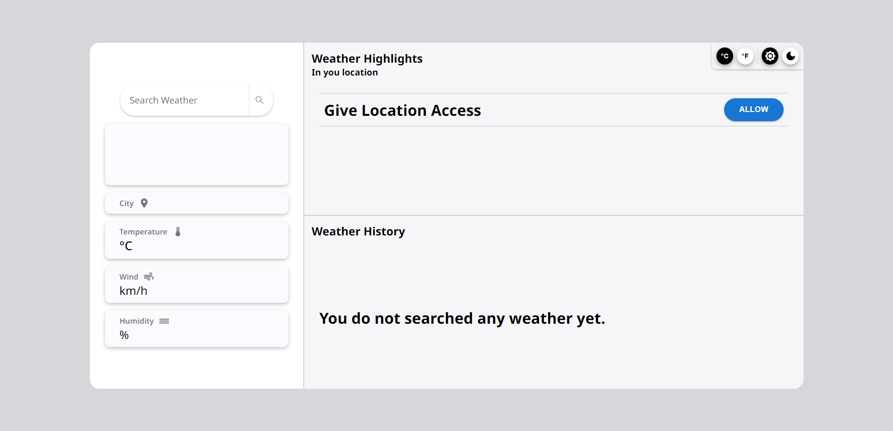
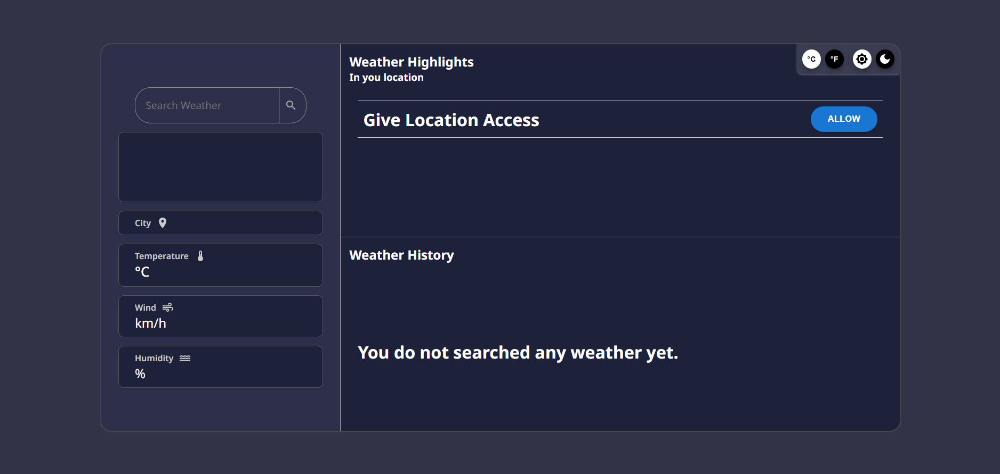
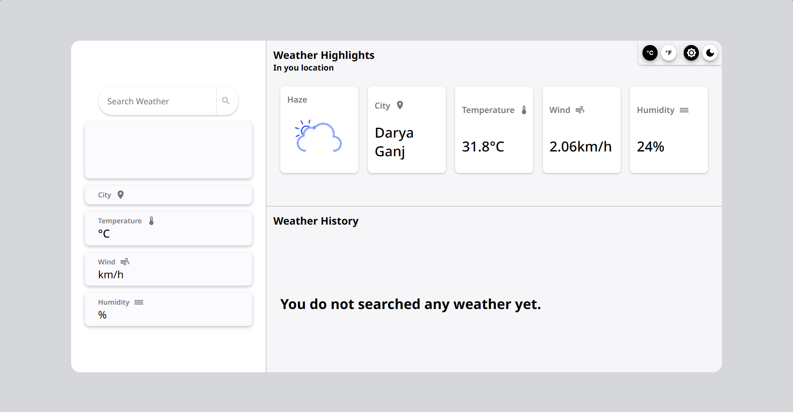
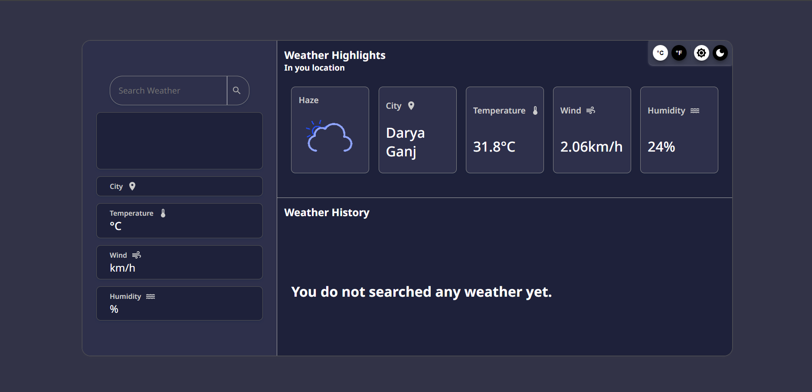
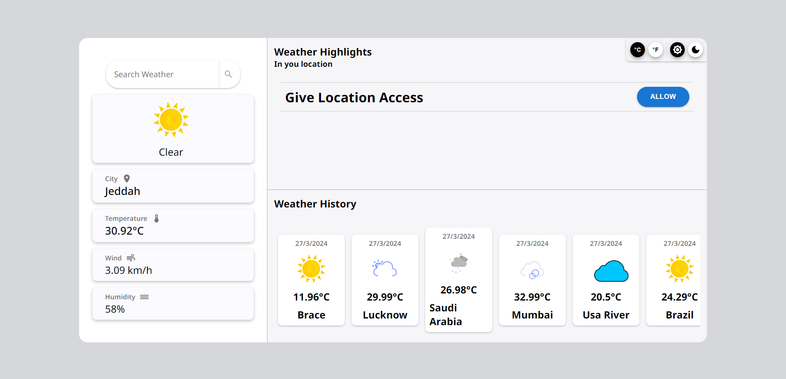
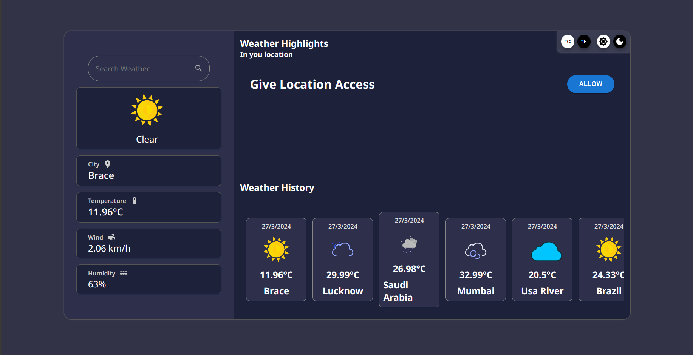
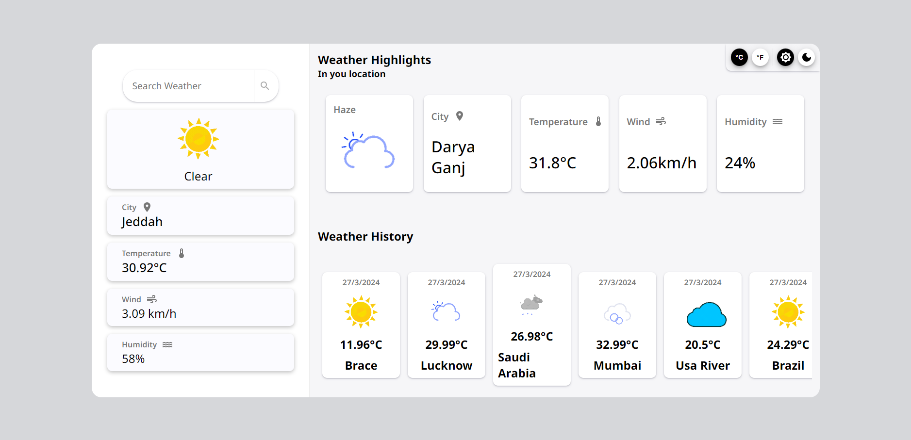
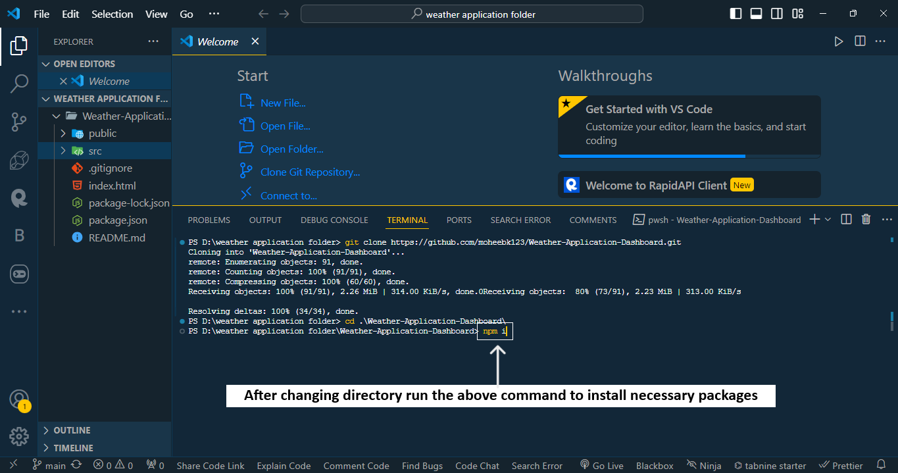
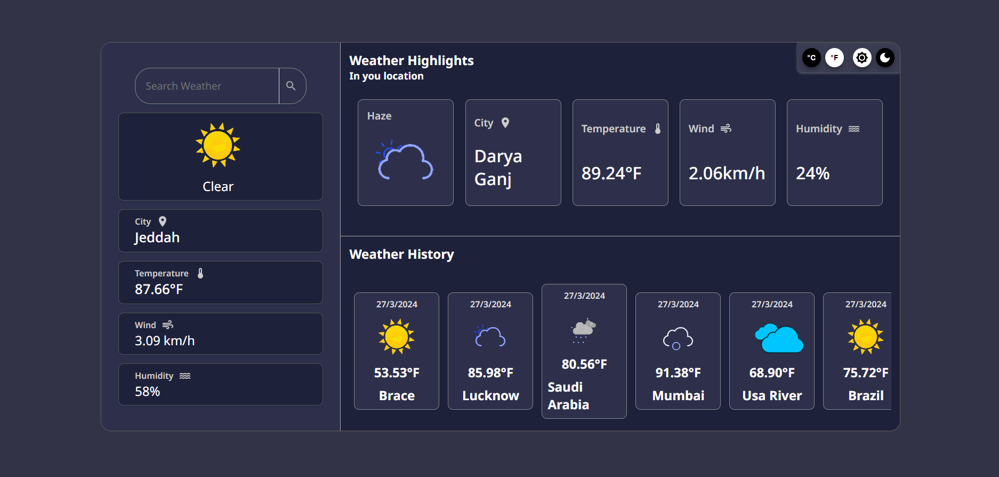

# Weather-Application-Dashboard

<h2>There are some images of websites in desktop view</h2>
<h3>Default view of light theme</h3>

<h3>Default view of dark theme</h3>

<h3>After allowing location access in light theme</h3>

<h3>After allowing location accessin dark theme</h3>

<h3>After searching weathers of some cities in light theme</h3>

<h3>After searching weathers of some cities in dark theme</h3>

<h3>Data in celcius in light theme</h3>

<h3>Data in celcius in dark theme</h3>

<h3>Data in farenheit in light theme</h3>

<h3>Data in farenheit in dark theme</h3>

 

<h2>If you want to run this application in your system, Follow the below steps:</h2>
<h3>
<li>Step 1: Choose a folder or directory in your sytem, or create a new folder or directory.</li>
</h3>
<h3>
<li>Step 2: Open the that forder or directory in vs-code.</li>
</h3>
<h3>
<li>Step 3: Open vs-code terminal with shortcut key :- " Ctrl + ` ".</li>
</h3>
<h3>
<li>Step 4: After opening the terminal,
 run this command :- "git clone https://github.com/mobheek123/Weather-Applications-Dashboard.git"
  to clone the repository in your system</li>
</h3>
<h3>
<li>Step 5: After cloning the repository,
 run this command :- "cd .\Weather-Applications-Dashboard\"
 to change directory to aplication directory.</li>
</h3>
<h3>
<li>Step 6: After changing the directory,
 run this command :- "npm i"
 to install the required package.</li>
</h3>
<h3>
<li>Step 7: After downloading the package,
 run this command :- "npm run dev"
 to start development server.</li>
</h3>
<h3>
<li>Step 8: Go to the link provided by vite in terminal, by clicking :- "Ctrl + click".</li>
</h3>
