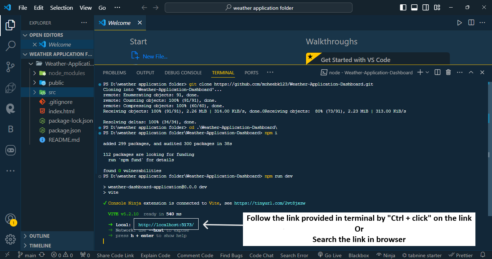

# Weather-Application-Dashboard

<h2>There are some images of WEATHER-DASHBOAD-APPLICATION in desktop view</h2>
<h3>Project view of light theme</h3>

<h3>Project view of dark theme</h3>

 

<h3>Features of this projects are given below:</h3>
<li>It provides a feature to search weather by city name, and shows information such as
   Weather Type (Rain, Clear, Cloud, etc.)
    City Name
   Temperature
   Wind Speed
   Humidity
</li>
<li>It shows the User Weather information same as search weather information, if user allowed location access.</li>
<li>It shows the Searched Weathers History which contans information such as
   Search Date
   Weather Type
   Temperature
   City
</li>
<li>It allows you to see temperature in celsius or fahrenheit.</li>
<li>It allows you to see application in dark or light theme.</li>
<li>It changes it's background according to day intervals like Morning, Afternoon, Evening, Night.</li>
<li>It is fully responsive.</li>
 

<h2>If you want to run this application in your system, Follow the below steps:</h2>
<h3>
<ol type="1">
  <li>
    Choose a folder or directory in your sytem, or create a new folder or
    directory.
  </li>
   
   
  
   
   
  <li>
    Open that forder or directory in VS Code.
     
     
    <ul>
      <li>Right click on selected folder and select "Show more options"</li>
       
       
      
       
       
      <li>Then select "Open with code" to open that folder in VS Code</li>
       
       
      
       
       
    </ul>
  </li>
  <li>Open VS Code Terminal with shortcut key :- " Ctrl + ` "</li>
   
   
  
   
   
  <li>
    Run the below command to clone repository
     "git clone https://github.com/moheebk123/Weather-Application-Dashboard.git"
  </li>
   
   
  
   
   
  <li>
    Run the below command to change Project Directory to Application
    Directory "cd .\Weather-Application-Dashboard\"
  </li>
   
   
  
   
   
  <li>
    Run the below command to install necessary packages  "npm i" or
    "npm install"
  </li>
   
   
  
   
   
  <li>
    Run the below command to start development server "npm run dev"
  </li>
   
   
  
   
   
  <li>
    Go to the link provided by vite in terminal by "Ctrl + click" or
    searching the link in browser
  </li>
   
   
  
   
   
  <li>Congratulations you run the application successfully</li>
   
   
  
</ol>
